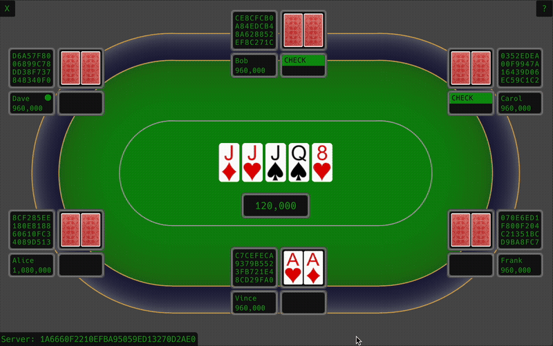
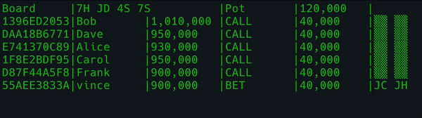

# Freezeout Poker.

<p align="center">
  
</p>

An easy to run Poker server with web and native clients.

## Features

- Multi tables [tokio][tokio-link] server.
- [egui][egui-link] web and native client.
- CLI [crossterm][cterm-link] client.
- Poker bot clients with custom strategy.
- WebSockets encryption over [Noise Protocol][noise-link].
- Message signatures for players and server identity.
- [Docker image](./docker/) to run the game server and a nginx server that serves the web client.
- Fast hand [evaluator](./crates/eval/).
- A Poker [cards](./crates/cards/) crate with egui cards textures (see [example](./crates/cards/)).
 
## Installation

To play **Freezeout** poker you need to run a server that accepts connections from
player clients and a client to connect to the server and play games.

### Install the server

Precompiled `freezeout-server` binaries for Linux, Mac, and Windows are available on
the [release][release-link] page. If you have Docker installed follow [these
steps](docker#run-the-poker-server) to run the server.

### Install the client

You can run the client as web application in a browser or as a native application.

When running the client in a browser there is no installation step but you have to
run a web server to serve the client, if you have Docker installed you can [start a
container](docker#run-the-web-server) that runs a nginx server that serves the
client.

For the native client there are precompiled `freezeout-gui` binaries for Linux,
Mac, and Windows on the [release][release-link] page.

## Running the server

The **Freezeout** server has the following options:

```bash
$ freezeout-server --help
Usage: freezeout-server [OPTIONS]

Options:
  -a, --address <ADDRESS>      The server listening address [default: 127.0.0.1]
  -p, --port <PORT>            The server listening port [default: 9871]
      --tables <TABLES>        Number of tables [default: 10]
      --seats <SEATS>          Number of seats per table [default: 3]
      --data-path <DATA_PATH>  Application data path
  -h, --help                   Print help
```

The first two options `--address` and `--port` configure the server networking. The
`--address` option sets the server’s listening address, the default `127.0.0.1`
(localhost) limits connections to the local machine, while `0.0.0.0` allows remote
connections. The `--port` is the listening port clients connect to.

The `--seats` option sets the number of players that have to join a table for a
freezeout game to start, once a game has started no other player can join the table
and the game ends when one player has won all the chips. The number of seats goes
from 2, for a heads up game, to 6 seats.

The `--tables` option sets the number of tables players can join, a player can only
join a table if a game hasn't started and will get an error if all tables are busy.
This option is useful to limit the number of concurrent games and reduce load.

The `--data-path` option sets the folder path where server data files are stored, by
default this is set to the standard applications path. The data folder contains the
database files for the players and the server signing key that is used to sign
messages sent to the clients.

## Running the egui client

The **Freezeout** UI native client has the following options:

```bash
$ freezeout-gui --help
Usage: freezeout-gui [OPTIONS]

Options:
  -a, --address <ADDRESS>  The server listening address [default: 127.0.0.1]
  -p, --port <PORT>        The server listening port [default: 9871]
  -s, --storage <STORAGE>  The configuration storage key
  -h, --help               Print help
```

The `--address` and `--port` options set the address and port the client connects to,
the optional `--storage` option sets the key for storing settings data to disk, this
is useful to keep client settings separate when running multiple clients, for example
if you run one client with:

```bash
$ freezeout-gui -- -s alice
```

and another client with:

```bash
$ freezeout-gui -- -s bob
```

then the clients will store their settings in different namespaces and will not
overwrite each other's settings. Client settings include the client window position
and the player identity that must be unique for each player at a table, if two
clients with the same player identity join a table they will join different tables.

When the app starts it shows a connection dialog that contains a nickname field, a
passphrase field with a generate button to generate a new phrase, a player identifier
label, and a connect button to connect to the server.

The passphrase is used to generate the private key for signing messages sent to the
server, each message includes the signature and the client public key to verify the
signature, the player identifier is the hash of this public key and represents the
players identity as only the holder of the corresponding private key can generate
valid messages.

Once connected the client shows the account window that contains the player nickname,
the player identifier, the total chips amount, and a join table button. When the
player presses the join table button the buy-in amount is detracted from the total
chips amount and if a table is available the player joins a table.

When a player joins a table the client shows the game view that contains the table
and the players seats, each seat shows the player identifier, nickname, chips, cards
and the player action, a countdown timer shows the active player. 

The client controls the player at the bottom and it shows action controls when it
becomes the active player, pressing `?` shows keyboard shortcuts for the various
actions.

## Running the web egui client

To run the web client for development go to the [`gui`](./crates/gui/) crate and run
[`trunk serve`][trunk-link]:

```bash
$ trunk serve
 ...
INFO 📡 serving static assets at -> /
INFO 📡 server listening at:
INFO     🏠 http://127.0.0.1:8080/
INFO     🏠 http://[::1]:8080/
INFO     🏠 http://localhost.:8080/
```

then load the UI in a browser using one of the URLs in the output. Note that clients
running in different browser tabs share the same connection settings so you may have
to generate a different identity before connecting if you want the client to join the
same table during testing, you can do this by pressing the generate button in the
connection dialog.

The [index.html](./crates/gui/index.html) contains the server and port parameters
under the `server-address` element, these need to be changed for a production
deployment, the [web docker image](docker#run-the-web-server) does that
automatically when you run the container.

## Running the CLI native client

<p align="left">
  
</p>


The CLI client is a simple [crossterm][cterm-link] client to quickly interact with
the server, to run it with `cargo`:

```bash
$ cargo r -p freezeout-cli -- --help
...
Usage: freezeout-cli [OPTIONS] --nickname <NICKNAME>

Options:
  -n, --nickname <NICKNAME>  This client nickname
  -h, --host <HOST>          The server listening address [default: 127.0.0.1]
  -p, --port <PORT>          The server listening port [default: 9871]
      --help                 Help long flag
```

When the client player action is requested you can use the following shortcuts:

- `f` fold
- `c` call or check
- `b` bet
- `r` raise
- `q` for exit
- Up/Dn for to adjust betting chips
- Enter to confirm betting action

## Writing a bot

You can create a bot that connects to the server and reacts to game events by
implementing the `Strategy` trait from the `freezeout-bot` crate, for an example see
the [simple](./crates/bot/examples/simple.rs) bot.

[egui-link]: https://github.com/emilk/egui
[cterm-link]: https://github.com/crossterm-rs/crossterm
[noise-link]: https://noiseprotocol.org/
[tokio-link]: https://tokio.rs/
[trunk-link]: htntps://trunkrs.dev/
[release-link]: https://github.com/vincev/freezeout/releases/latest

