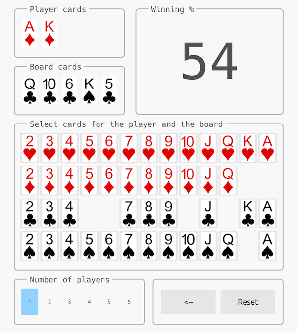

# Freezeout Poker Hands Evaluator

Poker hand evaluator for 5, 6 and 7 cards hands. This evaluator is a port of the
[Cactus Kev's][kevlink] poker evaluator with an additional lookup table for
faster 7 cards evaluation.

On my box I get ~50M 7-cards hands/s with a single thread and around ~140M 7-cards
hands/s with parallel processing (see examples below).

## Using Freezeout Evaluator

[freezeout-eval is available on crates.io](https://crates.io/crates/freezeout-eval).
To use it in your project add a dependency to your `Cargo.toml`:

```toml
[dependencies]
freezeout-eval = "0.2.1"
```

for maximum performance you can enable the following optimizations (see root `Cargo.toml`):

```
[profile.release]
opt-level = 3
lto = "fat"
```

## Running examples

To run the [single threaded example](./examples/eval_all7.rs):

```
$ cargo r --release --example eval_all7
...
Total hands      133784560
Elapsed:         2.480s
Hands/sec:       53950756

High Card:       23294460
One  Pair:       58627800
Two Pairs:       31433400
Three of a Kind: 6461620
Staight:         6180020
Flush:           4047644
Full House:      3473184
Four of a Kind:  224848
Straight Flush:  41584
```

To run the [multi threaded example](./examples/par_eval_all7.rs):

```
$ cargo r --release --features=parallel --example par_eval_all7
...
Total hands      133784560
Elapsed:         0.945s
Hands/sec:       141543977

High Card:       23294460
One  Pair:       58627800
Two Pairs:       31433400
Three of a Kind: 6461620
Staight:         6180020
Flush:           4047644
Full House:      3473184
Four of a Kind:  224848
Straight Flush:  41584
```

To run the [hands chart example](./examples/chart.rs):

```
$ cargo r --release --features=parallel --example chart
...
|-----|-----|-----|-----|-----|-----|-----|-----|-----|-----|-----|-----|-----|
| AA  | AKs | AQs | AJs | ATs | A9s | A8s | A7s | A6s | A5s | A4s | A3s | A2s |
| 85% | 67% | 66% | 64% | 64% | 61% | 61% | 59% | 58% | 58% | 57% | 56% | 56% |
|-----|-----|-----|-----|-----|-----|-----|-----|-----|-----|-----|-----|-----|
| AKo | KK  | KQs | KJs | KTs | K9s | K8s | K7s | K6s | K5s | K4s | K3s | K2s |
| 65% | 82% | 62% | 61% | 60% | 59% | 57% | 56% | 55% | 54% | 53% | 52% | 51% |
|-----|-----|-----|-----|-----|-----|-----|-----|-----|-----|-----|-----|-----|
| AQo | KQo | QQ  | QJs | QTs | Q9s | Q8s | Q7s | Q6s | Q5s | Q4s | Q3s | Q2s |
| 64% | 60% | 79% | 59% | 58% | 56% | 54% | 53% | 52% | 51% | 50% | 49% | 48% |
|-----|-----|-----|-----|-----|-----|-----|-----|-----|-----|-----|-----|-----|
| AJo | KJo | QJo | JJ  | JTs | J9s | J8s | J7s | J6s | J5s | J4s | J3s | J2s |
| 63% | 59% | 57% | 77% | 56% | 55% | 52% | 51% | 49% | 48% | 47% | 46% | 45% |
|-----|-----|-----|-----|-----|-----|-----|-----|-----|-----|-----|-----|-----|
| ATo | KTo | QTo | JTo | TT  | T9s | T8s | T7s | T6s | T5s | T4s | T3s | T2s |
| 62% | 58% | 56% | 54% | 75% | 52% | 51% | 49% | 47% | 45% | 44% | 43% | 43% |
|-----|-----|-----|-----|-----|-----|-----|-----|-----|-----|-----|-----|-----|
| A9o | K9o | Q9o | J9o | T9o | 99  | 98s | 97s | 96s | 95s | 94s | 93s | 92s |
| 59% | 56% | 54% | 51% | 50% | 71% | 49% | 47% | 45% | 43% | 41% | 41% | 40% |
|-----|-----|-----|-----|-----|-----|-----|-----|-----|-----|-----|-----|-----|
| A8o | K8o | Q8o | J8o | T8o | 98o | 88  | 87s | 86s | 85s | 84s | 83s | 82s |
| 58% | 54% | 52% | 50% | 48% | 46% | 69% | 46% | 44% | 42% | 40% | 38% | 38% |
|-----|-----|-----|-----|-----|-----|-----|-----|-----|-----|-----|-----|-----|
| A7o | K7o | Q7o | J7o | T7o | 97o | 87o | 77  | 76s | 75s | 74s | 73s | 72s |
| 57% | 53% | 50% | 48% | 46% | 44% | 43% | 66% | 43% | 41% | 39% | 38% | 35% |
|-----|-----|-----|-----|-----|-----|-----|-----|-----|-----|-----|-----|-----|
| A6o | K6o | Q6o | J6o | T6o | 96o | 86o | 76o | 66  | 65s | 64s | 63s | 62s |
| 56% | 52% | 49% | 46% | 44% | 42% | 41% | 40% | 63% | 40% | 39% | 37% | 35% |
|-----|-----|-----|-----|-----|-----|-----|-----|-----|-----|-----|-----|-----|
| A5o | K5o | Q5o | J5o | T5o | 95o | 85o | 75o | 65o | 55  | 54s | 53s | 52s |
| 56% | 51% | 48% | 45% | 42% | 40% | 39% | 38% | 37% | 60% | 39% | 37% | 35% |
|-----|-----|-----|-----|-----|-----|-----|-----|-----|-----|-----|-----|-----|
| A4o | K4o | Q4o | J4o | T4o | 94o | 84o | 74o | 64o | 54o | 44  | 43s | 42s |
| 55% | 50% | 47% | 44% | 41% | 38% | 37% | 35% | 35% | 35% | 56% | 36% | 34% |
|-----|-----|-----|-----|-----|-----|-----|-----|-----|-----|-----|-----|-----|
| A3o | K3o | Q3o | J3o | T3o | 93o | 83o | 73o | 63o | 53o | 43o | 33  | 32s |
| 54% | 49% | 46% | 43% | 40% | 38% | 35% | 34% | 33% | 33% | 32% | 53% | 33% |
|-----|-----|-----|-----|-----|-----|-----|-----|-----|-----|-----|-----|-----|
| A2o | K2o | Q2o | J2o | T2o | 92o | 82o | 72o | 62o | 52o | 42o | 32o | 22  |
| 53% | 48% | 45% | 42% | 39% | 36% | 34% | 32% | 31% | 31% | 30% | 29% | 49% |
|-----|-----|-----|-----|-----|-----|-----|-----|-----|-----|-----|-----|-----|
Elapsed: 0.950s
```

To run the egui [board](./examples/board.rs) example:

```bash
$ cargo r --release --example board
```

<p align="center">
  
</p>

[kevlink]: http://suffe.cool/poker/evaluator.html
